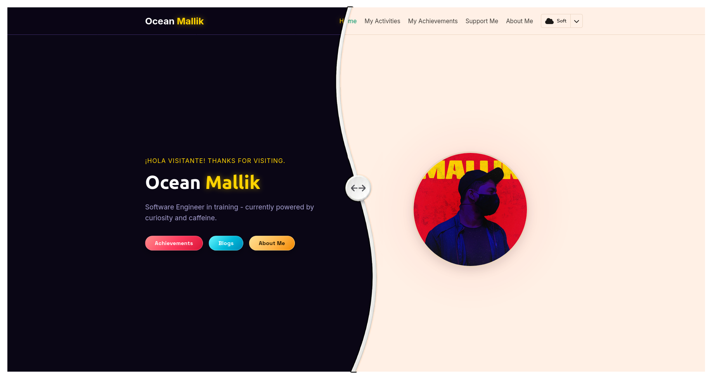

# Ocean Mallik — Personal Website

This repository holds a small, multi-page personal website for oceanmallik.com built with plain HTML, CSS and vanilla JavaScript. There is no build step or dependencies — deploy the files as static assets.

 

<table align="center">
	<tr>
		<td>
			<picture>
				
			</picture>
		</td>
	</tr>
</table>

## Live

- Main site: https://www.oceanmallik.com/
- Blog: https://blog.oceanmallik.com/
- Link hub: https://link.oceanmallik.com/

## What you'll find

- Static pages: `index.html`, `pages/about.html`, `pages/activities.html`, `pages/achievements/index.html`, `pages/support/index.html`, `pages/support/payment.html`
- Styling in `style.css` and behavior in `script.js`
- `myWorks.json` contains structured data used by the site
- `CNAME` for the custom domain

## Features

- Responsive layout for desktop and mobile
- Theme switcher (5 themes) persisted in `localStorage`
- Activity cards with status indicators
- Achievements/certificates showcase
- Support/donation flow with an internal payment page

## Contributing

This project is simple static content. To contribute:

1. Fork the repo and create a branch for your change.
2. Edit or add files and test locally (see Quick preview).
3. Open a pull request with a short description of your change.

## License

This project is licensed under the MIT License — see `LICENSE`.
